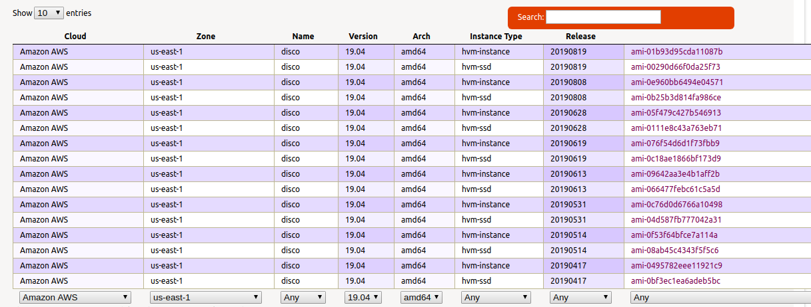

If you're working with AWS or Google and you need to spin up some instance with an Ubuntu image you can use the [Ubuntu Cloud Image Finder](https://cloud-images.ubuntu.com/locator/).



You can search for you cloud provider and Ubuntu version and find an image identifier like the image above.

It is very useful for spinning up an Ubuntu instance fast with command line like

```
aws ec2 run-instances --image-id ami-01b93d95cda11087b --count 1 --instanc
e-type m3.medium
```

or with Terraform

```
resource "aws_instance" "example" {
    ami = "ami-01b93d95cda11087b"
    instance_type = "m3.medium"
}
```